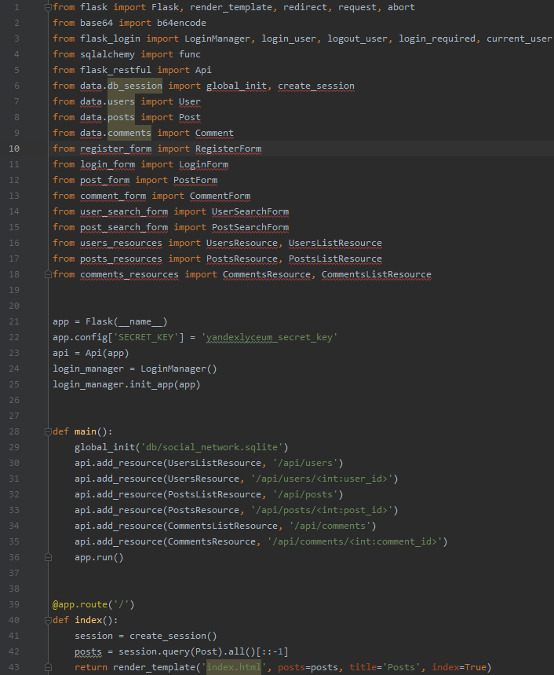
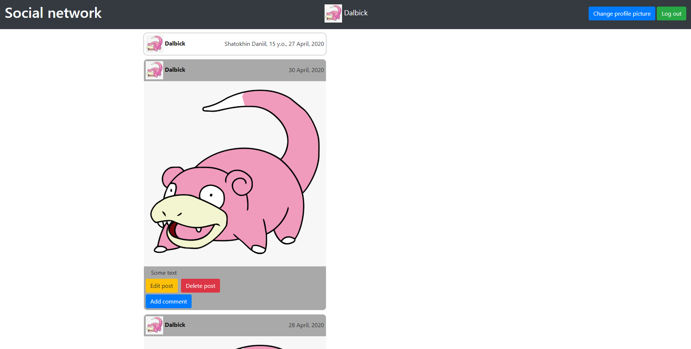

# Пояснительная записка к проекту «Social Network»
### Название проекта - «Social Network» 
### Автор проекта - Шатохин Даниил
### Описание идеи проекта:
Идеей данного проекта является создание социальной сети с хорошим дизайном, понятным интерфейсом и набором всех необходимых функций.
### Описание реализации проекта:
Присутствуют такие папки, как data, static, templates и db. Файлы можно разделить на 3 группы:
1. файлы с ресурсами для api (\*\*\*\_resources.py)
2. файлы с тестами для api (\*\*\*\_test.py)
3. файлы с формами (\*\*\*\_form.py)

Отдельно можно вынести файл main.py, который содержит обработчики url-адресов.
### Описание технологий и необходимые для запуска библиотеки:
Для хранения изображений в базе данных я использовал формат строк base64 и одноименную библиотеку. Также я использовал библиотеку datetime для определения текущего времени. Из внешних библиотек я использовал:
* flask (1.0.2)
* flask-login (0.5.0)
* flask-restful (0.3.8)
* flask-wtf (0.14.3)
* wtforms (2.2.1)
* sqlalchemy (1.2.11)
* sqlalchemy-serializer (1.3.4.2)
* werkzeug (0.14.1)
### Скриншоты приложения и программного кода:

